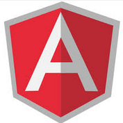
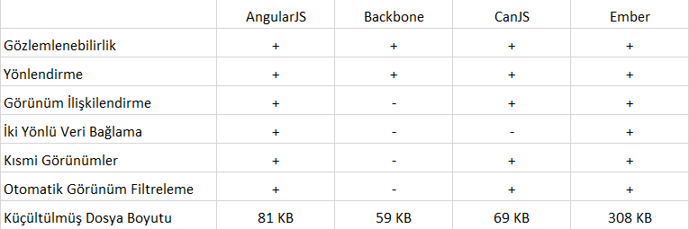
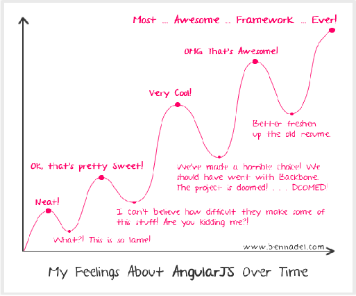
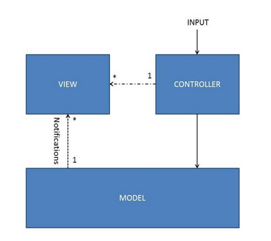
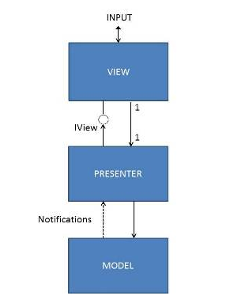
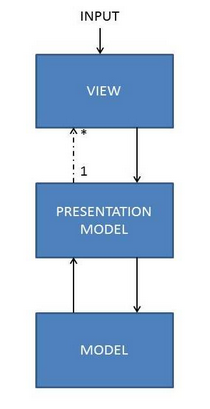

#   AngularJS

.fx: first

***develomer*** `<omer.isiker@bil.omu.edu.tr>`

***kbra*** `<kubra.oguz@bil.omu.edu.tr>`

*Less Code, More Fun*

---

##    AngularJS Nedir ? 

-   SPA(Single Page Application) türünde uygulamalar geliştirmemizi sağlayan bir framework

-   Daha az kod yazarak, daha çok iş yapmak için birebir

-   MVC(kendileri MVW olarak kabul eder) yapısı kullanır

-   MIT lisanslı

-   Google Community ürünü 

---

##   Alternatifleri Nelerdir?

-   Backbone

-   CanJS

-   Ember

-   Meteor

-   KnockoutJS

-   Zepto

-   Derby

-   Durandal

-   Total

-   Pedestal

-   Batman

---

##    Kıyas Yapmak Gerekirse?

---

##	Peki Zayıf Yanları?

-	Mantığı ve API' sini kavramak zor

-	Diğer kütüphanelerle çalışırken biraz sorunlu

---

##	Öğrenirken Neler Yaşarım?

	

---

##    Gerekli Ortamı Hazırla

-    Seed github adresinden local bilgisayara kopyala

		$git clone https://github.com/angular/angular-seed.git

---

##    Node Kur ve Çalıştır

-    Kurulum için seed dizinine geç

		$npm install

-    Çalıştır

		$npm start

---    

##    Dizin Yapısı

		app/                
  		   css/
    		      app.css
  		   img/
  		   index.html
  		   index-async.html
  		   js/
    		      app.js
    		      controllers.js
    		      directives.js
    		      filters.js
    		      services.js
  		   partials/
    		      partial1.html
    		      partial2.html

---

##    Nedir bu MVC yapısı?

-	Model:
		Verileri toparlar ve oluşan değişikliklerde view' i tetikler

-	View:
		Template denebilir. Hazırlanan template tüm modellere uygulanabilir

-	Controller:
		İşte sitenin beyni! Burada model-view ilişkileri ya da ekleme-çıkarma gibi işlemler yapılır

---

##    AngularJS' te MVC

-	AngularJS geliştiricileri resmi web sitelerinde de ifade ettikleri gibi oluşturdukları yapıya
	MVC değil, MVW adını verirler

-	MVW(Model-View-What ever works for you)

---

##    MVW' de Neymiş Öyle!

-	Model-View-Whatever works for you ifadesi işimize gelen şablonu kullanabileceğimiz anlamına gelir

-	Kullanabileceğimiz üç yapı var	
	
	-	MVC(Model-View-Controller)

	-	MVP(Model-View-Presenter)

	-	MVVM(Model-View-ViewModel)

---

##    MVC

---

##    MVP

---

##    MVVM

---

##    Hadi biraz daha işin içine girelim
####    Örnek Bir Kod Parçası

		<html ng-app>
		<head>
			
		</head>
		<body>
 			<input type="text" ng-model="isminiz" 
			placeholder="Adınızı Giriniz">  
			Merhaba {{isminiz}}
		</body>
		</html>

---

##    Neler Oluyor Orada

		-	<html ng-app>
			-	Browser' a AngularJS kullanıldığını belirt		
			-	Otomatik olarak AngularJS' ı başlat

		-	

			-	Değişken tanımlamamızı ve değer ile ilişkilendirilmesini sağlar
---

##    Nasıl Çalışır?

-	Sayfa yüklendiğinde ve AngularJS devreye girdiğinde tüm sayfa taranır. Html standartında olmayan 
	tüm directive, controller gibi mekanizmalar elden geçirilip saf Html koduna çevrilir

---

##    Directive

###	Nedir?

-	Özel html elementlerini oluşturma ve DOM işlemede kullanılır

-	DOM elemanlarına özel davranışlar eklenmesini sağlar

###	Neden Kullanılır?

-	Kendi özel bileşenlerimizi oluşturmak istediğimizde kullanırız

-	Ön tanımlı bir çok directive var

-	ng ile başlar

-	Gerçekleştirimi ngRoute şeklinde olan bir directive ng-route şeklinde kullanılır

-	Tüm directive' ler için ---> [buradan](https://docs.angularjs.org/api/)

---

##	Controller

###	Nedir?

-	Angular' da scope' u çoğaltmak için kullanılan constructor fonksiyon

-	Kullan:

	-	$scope nesnesinin başlangıç durumunu oluşturma

	-	$scope nesnesine davranış ekleme

-	Kullanma:

	-	DOM üzerinde oynama yapma

	-	Girişleri düzenleme(bunun yerine angular form control kullan)

	-	Çıkışları filtreleme(bunun yerine angular-filters kullan)

	-	Controller arasında durum ya da kod paylaşımı yapma(bunun yerine angular services kullan)

	-	Diğer componentlerin yaşam döngüsünü yönetme

---

##    Başka Neler Var?

-	ng-controller:
	-	ilgili kısmın hangi controller taraından yönetileceği belirtlilir
	-	bir html üzerinde birden fazla controller olabilir
	-	İç içe controller kullanımı yapılabilir

-	ng-class:
	-	ilgili kısma class ataması yapar
	-	bu konuda koşul koymamıza olanak verir

-	ng-click:
	-	ilgili elemente click event' ı atamamızı sağlar
	-	click event' ı için hangi fonksiyonun çağırılacağı burada belirtilir

-	ng-repeat:
	-	bir liste üzerinde dönüp işlem yapmamızı sağlar

---

##    Scope' lar Nedir ve Ne Yaparlar?

-	Scope' lar görünümü yorumlarken kullanılan, işlevsellik ve veri içeren objeler

	-	Model değişikliklerinin izlenmesini sağlarlar

	-	Model değişikliklerinin uygulama boyunca yayılmasını sağlarlar

	-	Fonksiyon, model için özel ve iç içe olabilirler

---

##    Services

###    Nedir?

-	AngularJS servisleri DI kullanarak bağlantıları oluşturan yerleşik nesnelerdir

-	AngularJS servisleri tembel ve tekil yapıdadır:
	-	Tembel Yapı - Angular servisi sadece uygulama component' i
		ona ihtiyaç duyduğunda başlatır

	-	Her component angular factory tarafından referans gösterilen
		sadece bir servise bağlıdır 

-	Module içinde $provide kullanılarakta servis oluşturulabilir

---

##    Dependency Injection

-	Genel olarak nesnein bağımlılıklarını tutabilmesi için kullanılan üç yol var

	1	Dahili olarak tanımlama

	2	Global olarak tanımlama

	3	İhtiyacımız olan yerde kullanma

-	AngularJS' te 3. yöntem kullanılır

---

##    Ne Demek İstiyorum?

-	Bir arayüz sınıfını implemente eden çeşitli sınıflar oluşturulduğunda
	bunları kodun içine direk tanımlamak yerine parametre olarak alma

###	Neden?

-	Sınıflar modülün içinde tanımlanmak yerine implemente ettikleri arayüz sınıfı
	tipinde bir nesne parametre olarak kullanılırsa projenin ihtiyacına göre değişecek
	sınıf kullanımı modülün derdi olmaktan çıkar

-	İşimizi görecek herhangi bir nesne modülümüze kolaylıkla enjekte edilebilir

---

##    SON

	Teşekkür Ederiz

---

##    Kaynakça
		
		http://www.denizirgin.com/
		
		https://angularjs.org/

		http://slidedeck.io/

		http://www.bennadel.com/

---
