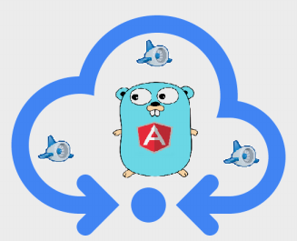
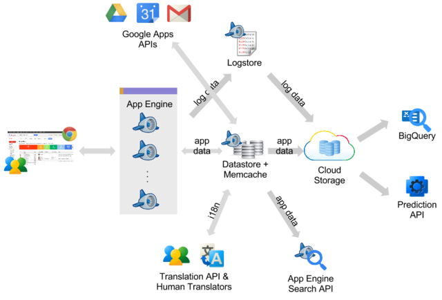
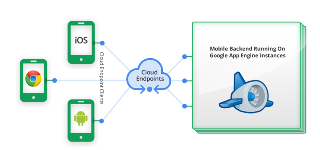

#   Gopheran

.fx: first

***Aşkın GEDİK*** `<askn@bil.omu.edu.tr>`

***Ömer İŞIKER*** `<omer.isiker@bil.omu.edu.tr>`

Kaynak Envanteri Yönetim Sistemi

---

##    Neyi Amaçladık

- Kaynak Envanteri Yönetimi probleminin küçük bir parçasını çözmeyi amaçlıyoruz
 
---

##    Nereden Başladık

- Problemin ilk adımı olan güvenli iletişim

- Açık SSH anahtarlarının yönetimi

---

##    Neler var

- Go dili

- AngularjS

- Google App Engine

- Google Cloud Endpoints

---

#   App Engine Nedir

- Google firmasının web uygulamaları için bir bulut servisi

- 7 Nisan 2008 duyurulmuş

- Load Balance(Yük paylaşımı) ve Auto Scaling(Otomatik Ölçekleme)

- Python, Java, Php, Go destekliyor

---

#   Neden App Engine

- Düşük Maliyetli

- Zengin Google API'leri

- Kolay Kullanım ve deploy

- Hızlı ve esnek geliştirme ortamı

---

#   App Engine Mimarisi

---

#   Veri Depolarken

- Google Cloud SQL

- AppEngine Datastore

---

#   Datastore Özellikleri

- planlanmamış kesinti yok

- yüksek kullanılabilirlik

- tutarlı sorgular

- transaction

- NoSQL

- Join yok

---

##  Neden Go

- 

---

#   Endpoints

- Frontend ve Backend kısımlarını ayırmamızı sağlar

- Appengine üzerinde oauth desteği ile kolay api'ler yazmaya yarar

---

##  Endpoints

---

## Neden AngularJS?

- Google destekli

- MVC mimarisi sunuyor

- Küçültülmüş dosya boyutu sadece 81 kb

- Daha az kod kullanarak daha çok iş yapmamızı sağlar
 
---

