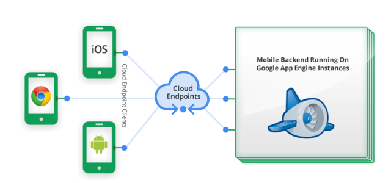
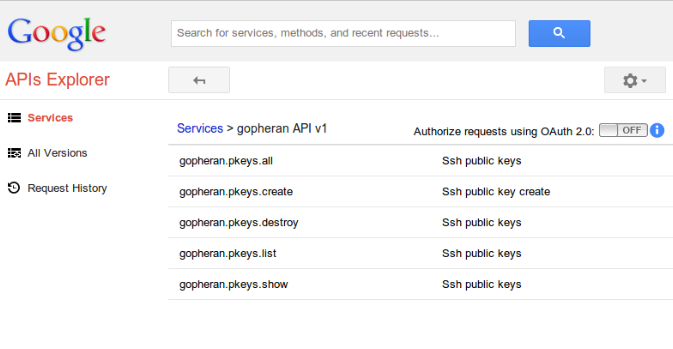

#   Kaynak Envanter Yönetimi

.fx: first

***Aşkın GEDİK*** `<askn@bil.omu.edu.tr>`

***Ömer İŞIKER*** `<omer.isiker@bil.omu.edu.tr>`

<gopheran>

Haziran 2014

---

## Gündem

- Projenin yola çıkış amacı

- Kullanılan Teknolojiler

- Karşılaşılan sorunlar

- Projenin Bize Katkısı

- Demo

---

## Yola Çıkış Amacı

- Bir kuruma ait donanım ve yazılım kaynakları (web servisleri, veritabanları, makine parkı, ağ donanımları) kayıtlarının tutulması 
	
	- Kuruma ait bilgi işlem kaynaklarının kayıtlarını tutan “restfull” erişilebilir arka yüz
	
	- Web ön yüzü (Web istemcisi)

---

## Proje Amacının Evrimi

- Kaynaklara erişim sırasında kullanılan anahtarların yönetilmesi daha önemli bir problem

- Kurum içinde SSH açık anahtarı paylaşmak için bir servise ihtiyaç var

---

## Kullanılan Teknolojiler

- Google App Engine
- Google Cloud Endpoints
- Golang
- AngularJS
- Bootstrap
- Bower
- Vagrant
- Github
- Trello

---

## Kullanılan Teknolojiler

- Appengine: Uygulamayı barındırıyor

- Google Cloud Endpoints: Uygulama gövdesi

- Backend ve Frontend’i birleştiren kısım

- Golang: Backend kısmında api yazıldı

- Angularjs: Frontend kısmında kullanıldı

- Bootstrap: Arayüz tasarımı

- Bower: Frontend için paket bağımlılıklarını yöneten araç

---

## Neden App Engine Kullandık

- Bölüm içinde kullanılan google apps ile entegre çalışabilmesi

- Sadece belirli Google Apps Domainlerine kullanım izni verilebilmesi

- Düşük Maliyetli

- Zengin Google API’leri

- Kolay Kullanım ve deploy

- Hızlı ve esnek geliştirme ortamı

---

## Google Cloud Endpoints

---

## Endpoints Ne Yapar

- API ve kullanıcı bazlı kütüphane oluşturmaya olanak verir

- Web ya da telefon kullanıcıları için hazırlanacak web backend’in oluşturmasını kolaylaştırır

- App Engine üzerinde oauth desteği ile kolay API’ ler yazmaya olanak verir

---

## Kullanım Senaryosu

- Kurum içindeki personel sisteme email hesabı ile giriş yapar 

- SSH anahtarlarını yükler

- Sistem Yöneticisi yüklenen anahtarlar arasından yetki vereceği personelin ssh anahtarını çekerek kaynaklara erişimine izin verir

---

## Getirdiği Çözümler

- Kaynaklara erişim için açık anahtar yönetimi

- Belirli Google Apps domainlerine çalışma iznine sahip bir yapı

---

## Go ile yapılan API fonksiyonları

---

## Karşılaşılan Sorunlar

- Doküman eksikliği

- Örnek kod eksikliği

- Frontend ile bağlantı konusunda oluşan sıkıntılar

---

## Projenin Bize Katkıları

- App Engine Kullanım yetkinliği

- Google tarafından geliştirilen yeni veri tabanı yapısı Datastore 

- Endpoints yapısı ile Api üretebilme yeteneği

- Angularjs ve Golang ile yazılım geliştirebilme yeteneği

- Vagrant, VirtualBox gibi yazılımlar üzerinde geliştirme ortamı oluşturma ve geliştirme yapabilme tecrübesi

---

# Demo

# Teşekkür Ederiz
